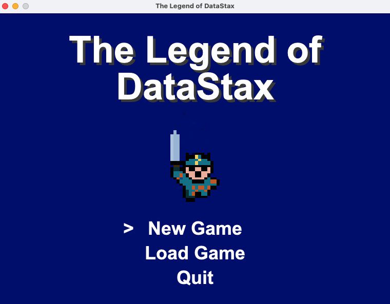
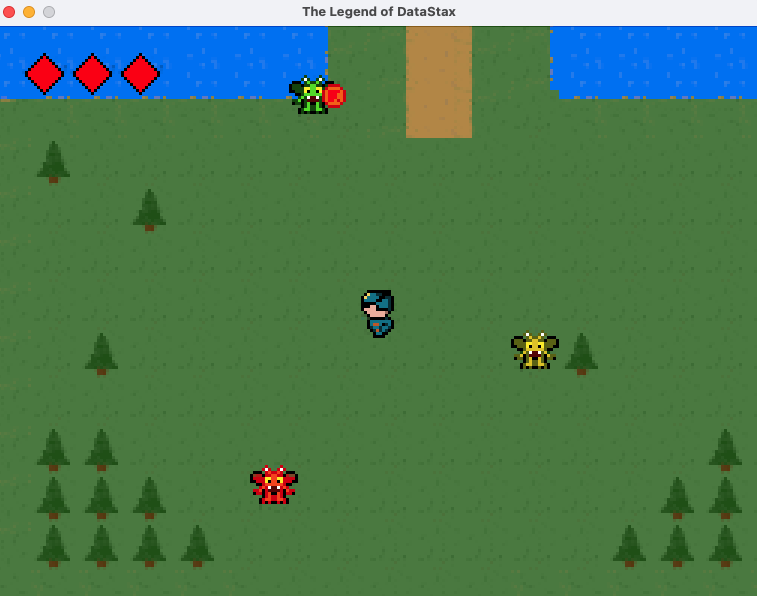
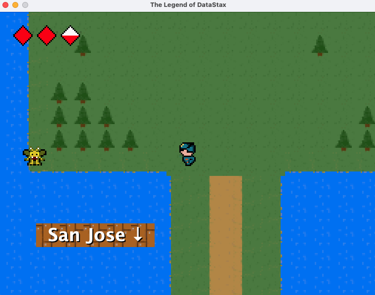
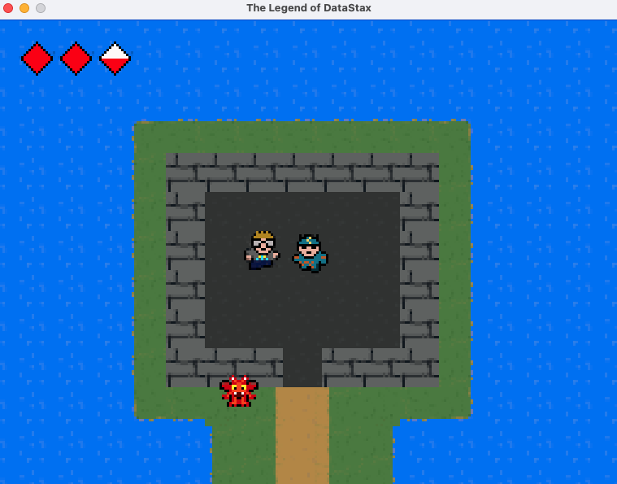

# The Legend of DataStax

Fight the treacherous demons of NoSQL!

https://youtu.be/4FEIyDtZF9c

## Screenshots






## How to run
 - Clone this repo and run a `mvn clean install`, followed by a `java -jar` command on the "with dependencies" JAR file created in the `/target` dir.

 Or

 - Download the JAR file listed above, and run with `java -jar`:

```
java -jar legendofdatastax.jar
```

## Controls
 - Movement: w, a, s, d
 - Attack/Talk: enter
 - Pause: esc
 - Character Sheet: c (buggy)

## Notes:
 - Music can be turned on in the `setup` method of `GamePanel.java`.
 - Number of monsters can be increased in the `generateMonsters` method of `ObjectFactory.java`.
 - Monster difficulty can be adjusted (speed, health points, attack) in the individual classes found in the [/monsters](https://github.com/aar0np/LegendOfDataStax/tree/main/src/main/java/monster) dir.

## Additional callouts and credits

 - Game engine created using [RySnow](https://www.youtube.com/@RyiSnow)'s "How to make a Java 2D Game" [video playlist](https://www.youtube.com/playlist?list=PL_QPQmz5C6WUF-pOQDsbsKbaBZqXj4qSq).

 - Music and sound effects from [Pixabay](https://pixabay.com/sound-effects/search/8-bit/?manual_search=1&order=None).
